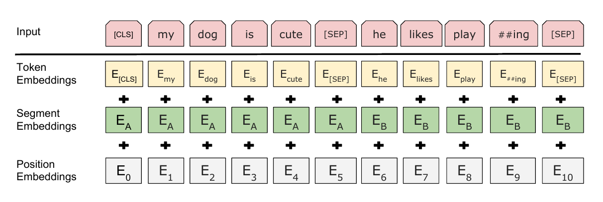

### bert代码解读

bert代码主要集中在run_pretraing.py与modelling.py中
run_pretraing.py主要负责读取生成好的tf.data训练数据，调用Transformer encoder部分代码，生成预测与损失函数。
modelling.py主要包含Transfomer encoder代码，Multihead attention代码等。

bert输入数据：

input:最原始的数据输入，需要转化为数字向量，数字向量包括：
TokenEmbeddings:token 字符查表对应的向量   
Segment Embeddings:分句向量，用于区分上下句。一般用数字0和1表示。   
Position Embeddings:

BERT中的位置编码是训练出来的，和transformer不同。
在multiattention后，bert有一个全链接层，然后resudual+laynerNormal，原论文中没有。
BERT的输入只有TokenEmbeddings(input_id),(Segment Embeddings)segment_id,Positions Embeddings(mask_id)
优缺点：
BERT算法还有很大的优化空间，例如我们在Transformer中讲的如何让模型有捕捉Token序列关系的能力，而不是简单依靠位置嵌入。
BERT的训练在目前的计算资源下很难完成
BERT在MLM任务中的mask策略对真实的单词产生偏见。目前还未显示这种偏见对训练的影响。